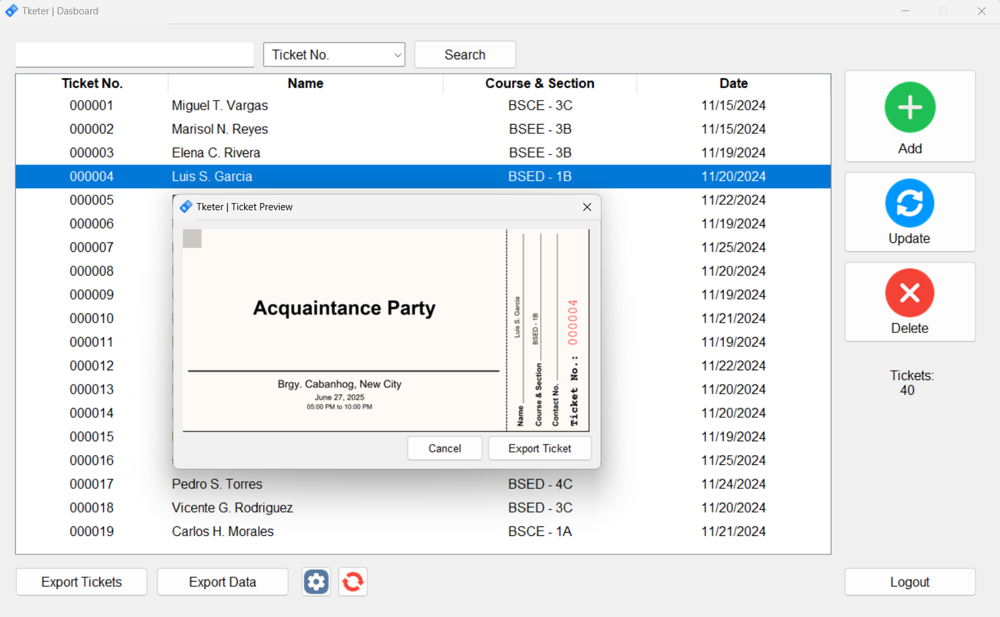

# Tketer | Tkinter-based Ticketing System w/ MySQL



Tketer is an application designed to address the inconvenience of managing school events. It includes entry management, ticket creation, and spreadsheet creation from database entries.

## Features
1. **Entry Management**
-  Tketer makes creating, updating, and deleting entries convenient. Simply click on the corresponding button and follow the prompts.
2. **Persistent Event Memory**
- During the initial configuration, Tketer requires an event configuration. This includes the event name, venue, date, and time. Which will be used to create tickets and spreadsheets.
3. **Ticket Creation**
- Using Pillow, Tketer is capabable of creating tickets using a template. Tickets can be created for a single entry (double clicking on the entry) or for all the entries (using the **Export Tickets** function).
4. **Spreadsheet Creation**
- Tketer can produce a spreadsheet (in the form of .xlsx files) from the entries in its database. Which can be sorted into categories for seamless organization. This reduces the workload needed to process paperworks when managing events.

## Setup
This application requires the following python external libraries/packages:
1. Pillow
2. openpyxl
3. mysql-connector-python

You can install these packages in one go with the command:
```bash
pip install -r requirements.txt
```
The above command will read the packages specified in the txt file and install them. You can install each package manually.

## Running The Application
You need to have a mysql server installed in your computer to be able to run the application.
The application is set to connect to a database in the localhost with a basic password. (Change the user, password, host, and database name according to your mysql configurations)
By default, it will connect to a database named **tketer**. Simply create a table with that name.
```mysql
CREATE DATABASE tketer;
```
The application defaults to using *tketer_user* with a password of *ILoveTickets* to communicate with the db. You can change the configuration inside database_manager.py or keep it as is by creating the user:
```mysql
CREATE USER tketer_user@localhost IDENTIFIED BY 'ILoveTickets';
GRANT ALL PRIVILEGES ON tketer.* TO tketer_user@localhost;
```

Run the *database_guide.py* first. This will create a user table used to log in to the application. The defaults are in the file, change them as needed.

Finally, run **main.py** to start the application.
